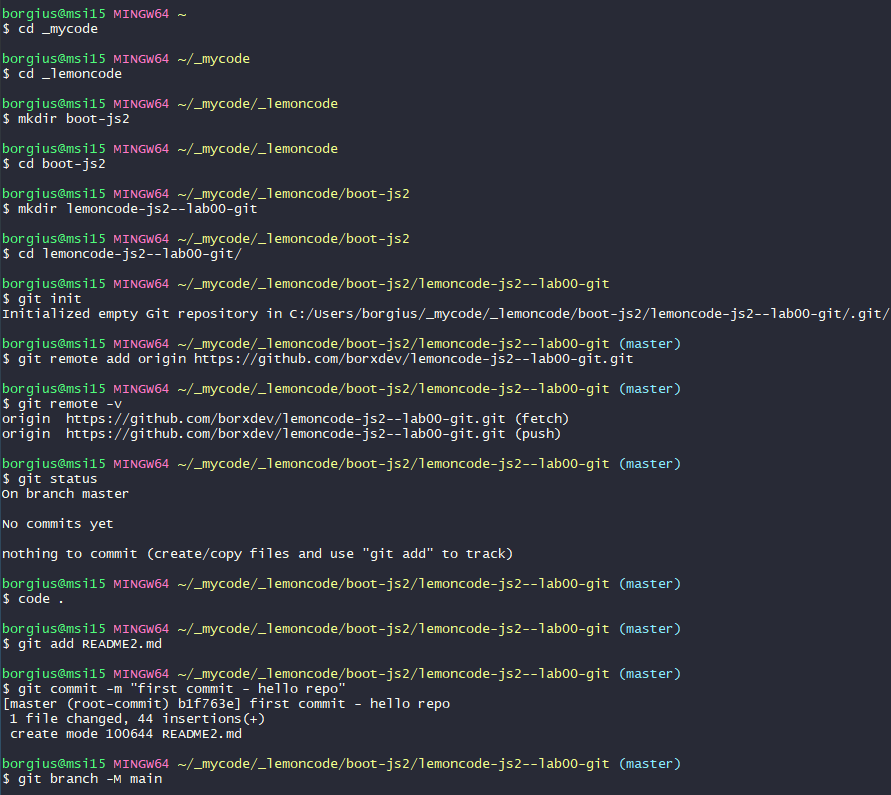
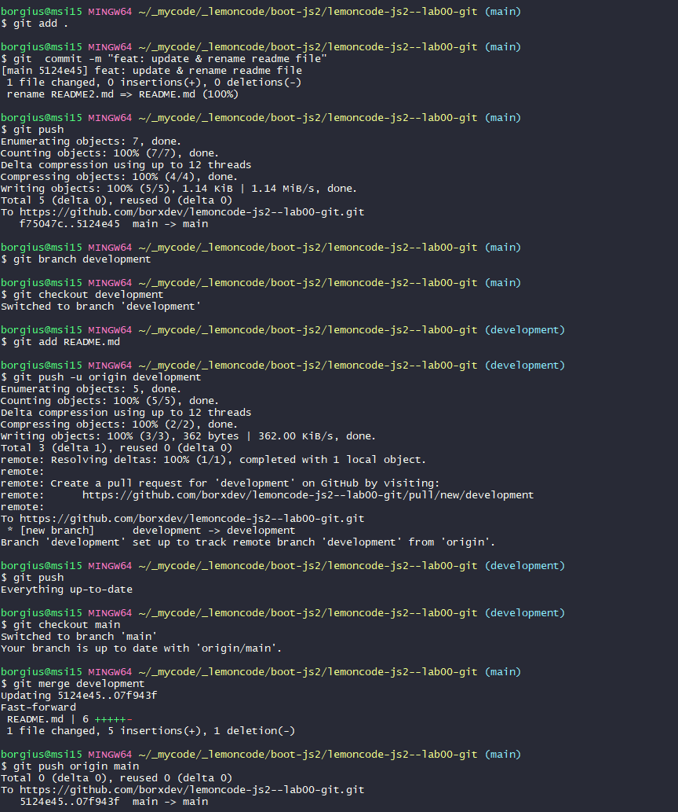

Bootcamp Javascript 2
# 0. Laboratorio Git

Este laboratorio tiene como objetivo que practiques los comandos básicos de Git. Para ello, deberás crear un repositorio en local y subirlo a GitHub. Luego, deberás crear una rama, hacer un merge y resolver los conflictos que se presenten si fuera el caso.

## Objetivos

### 1. Crear un repositorio en local
    - Abre tu terminal y navega hasta el directorio donde deseas crear el repositorio.
    - Crea una carpeta con el nombre del repositorio.
    - Ingresa a la carpeta que acabas de crear.
    - Inicializa el repositorio de Git.

### 2. Subir el repositorio a GitHub

    - Crea un nuevo repositorio en GitHub.
    - Copia el URL del repositorio que acabas de crear en GitHub.
    - Conecta tu repositorio local con el repositorio en GitHub.
    - Verifica que la conexión se haya establecido correctamente.

### 3. Hacer un commit y un push
    - Crea un archivo en la carpeta del repositorio.
    - Añade el archivo al staging.
    - Crea un commit con un mensaje descriptivo.
    - Sube los cambios al repositorio en GitHub.

### 4. Crear una rama
    - Crea una rama nueva llamada "development".
    - Cambia a la nueva rama.
    - Realiza algunos cambios en el archivo que creaste.
    - Añade y haz un commit con los cambios en la rama "development".
    - Sube los cambios a Github.

### 5. Hacer un merge
    - Vuelve a la rama "main".
    - Haz un merge de la rama "development" a la rama "main".
    - Si no hay conflictos, los cambios realizados en la rama "development" se incorporarán a la rama "main".
    - Hax un push de los cambios al repositorio en GitHub.

---

